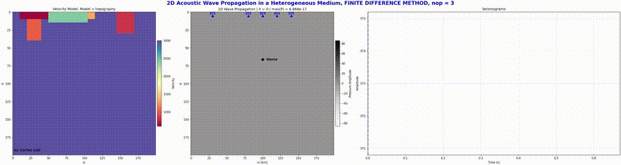

<p align="center">
  
</p>


## 2D-Wave-Propagation-FDM-PSM.

Python package for **2D wave propagation simulations** using the **Finite Difference Method (FDM)** and the **Pseudo-Spectral Method (PSM)**.

This repository is intended for users interested in numerical wave propagation, seismic modeling, and computational simulations in heterogeneous media. It provides reusable Python classes for simulation, visualization, seismogram extraction, Fourier-based derivatives, and video generation.

---

## Author.

**Carlos Celi**  
Structural Engineer and Researcher  
Pontificia Universidad Católica del Ecuador

WebPage: [Carlos Celi](https://normando1945.wixsite.com/cceli)

---

<p align="center">
  <a href="https://github.com/Normando1945/2D-Wave-Propagation-FDM-PSM/actions/workflows/python-check.yml">
    
  </a>
  
</p>


---

## Demo

A short demonstration of the 2D wave propagation workflow is shown below.

<p align="center">
  
</p>


## Features

- 2D wave propagation tools
- Finite Difference Method (FDM) solver
- Pseudo-Spectral Method (PSM) solver
- Velocity model visualization
- Seismogram generation at multiple receivers
- Real-time animation support
- MP4 video export using `FFMpegWriter`
- Fourier-based derivative operators
- Example notebook for numerical experimentation

---

## Repository Structure

```text
2D-Wave-Propagation-FDM-PSM/
│── .github/
│   ├── ISSUE_TEMPLATE/
│   ├── workflows/
│   │   └── python-check.yml
│   ├── dependabot.yml
│   └── PULL_REQUEST_TEMPLATE.md
│
│── examples/
│   └── example_2D_propagation.ipynb
│
│── figures/
│
│── videos/
│
│── wave_propagation_2d/
│   ├── __init__.py
│   └── core_wp_2d.py
│
│── .gitignore
│── CODE_OF_CONDUCT.md
│── CONTRIBUTING.md
│── LICENSE
│── README.md
│── SECURITY.md
│── requirements.txt
│── setup.py
```

---

## Installation

Clone the repository using either **HTTPS** or **SSH**.

### Option A. HTTPS (recommended for most users)

```bash
git clone https://github.com/Normando1945/2D-Wave-Propagation-FDM-PSM.git
cd 2D-Wave-Propagation-FDM-PSM
```

### Option B. SSH (recommended for users with GitHub SSH already configured)

```bash
git clone git@github.com:Normando1945/2D-Wave-Propagation-FDM-PSM.git
cd 2D-Wave-Propagation-FDM-PSM
```

Install the required Python packages:

```bash
pip install -r requirements.txt
```

Install the package in editable mode:

```bash
pip install -e .
```

---

## System Dependency for Video Export

To export MP4 videos, `matplotlib` uses `FFMpegWriter`, which requires **ffmpeg** to be installed in the operating system.

For Arch / Omarchy:

```bash
sudo pacman -S ffmpeg
```

---

## Main Package Import

After installation, the package can be imported as:

```python
from wave_propagation_2d import (
    FFt_src,
    Fourier_derivate_n_order,
    animation2D_FDM,
    animation2D_PeudoSpectral,
)
```

---

## Example Usage

```python
import numpy as np
from wave_propagation_2d import animation2D_FDM

# Number of grid points in x and z directions
nx = 200
nz = 200

# Spatial and temporal discretization
dx = 10.0
dt = 0.001
nt = 1000

# Reference wave velocity
c0 = 2000.0

# Homogeneous 2D velocity model
c = np.ones((nz, nx)) * c0

# Source location indices
isx, isz = 100, 100

# Receiver location indices
irx = [60, 100, 140]
irz = [20, 20, 20]

# Time vector
t = np.arange(nt) * dt

# Example source time function
src = np.exp(-((t - 0.03) ** 2) / (2 * (0.005 ** 2)))

# Create the FDM simulation object
anim = animation2D_FDM(
    nx=nx,
    nz=nz,
    dx=dx,
    dt=dt,
    nt=nt,
    model_type="homogeneous",
    c=c,
    isx=isx,
    isz=isz,
    irx=irx,
    irz=irz,
    src=src,
    idisp=10,      # Plot update interval
    nop=3,         # Finite-difference operator: 3-point or 5-point
    show=False,    # Do not display animation interactively
    save=True      # Save the simulation as an MP4 video
)

# Run the simulation and store the seismograms
seis = anim.animate()
```

---

## Output

The repository currently generates the following outputs:

- Numerical simulation of the 2D wavefield
- Receiver seismograms extracted at the specified receiver locations
- Real-time animation display during the simulation
- MP4 video files automatically saved when export is enabled
- Supporting visual results that can be organized in the `figures/` and `videos/` folders
- Educational examples and workflows demonstrated in the `examples/` folder

```text
examples/
figures/
videos/
```

---

## Example Notebook

An example notebook is provided in:

```text
examples/W5_P2.ipynb
```

This notebook shows how to:

- define model parameters
- generate source functions
- create velocity models
- run FDM simulations
- run Pseudo-Spectral simulations
- visualize and save results

---

## Dependencies

Main Python dependencies:

- `numpy`
- `pandas`
- `matplotlib`
- `ipython`
- `pillow`

See `requirements.txt` for details.

---

## Acknowledgment

This repository was developed as an independent adaptation and extension inspired in part by the wave propagation teaching material and scientific work of **Prof. Dr. Heiner Igel**.

His academic work in computational seismology and seismic wave propagation has been an important reference for the development of this repository.

The mathematical formulations, code structure, modifications, implementation details, and workflow presented here correspond to **my own adaptation and development**.

Official profile: [Prof. Dr. Heiner Igel - LMU Munich](https://www.cas.lmu.de/en/people-at-cas/details/heiner-igel-e2b01c98.html)

---

## Notes

- The current implementation is focused on 2D acoustic wave propagation workflows.
- Video saving requires `ffmpeg` to be installed in the system.
- This repository reflects an actively evolving numerical workflow and may be extended with additional model configurations and computational features.

---

## How to Cite

If you use this repository in academic work, class projects, reports, presentations, or educational material, please cite it as follows.

### BibTeX

    @misc{celi2026wave,
      author       = {Carlos Andrés Celi Sánchez},
      title        = {Wave Propagation: Educational Python Simulations Using Finite-Difference and Pseudo-Spectral Methods},
      year         = {2026},
      publisher    = {GitHub},
      journal      = {GitHub repository},
      howpublished = {\url{https://github.com/Normando1945/2D-Wave-Propagation-FDM-PSM.git}}
    }

### APA (7th Edition)

Celi S., Carlos. A. (2026). *Wave Propagation: Educational Python Simulations Using Finite-Difference and Pseudo-Spectral Methods* [Computational Wave Propagation]. GitHub. https://github.com/Normando1945/2D-Wave-Propagation-FDM-PSM.git

---

## License
<p align="center">
  
</p>

This project is licensed under the MIT License. See the `LICENSE` file for more details.

---

## Contributing

This repository is maintained by the author as an educational and research-oriented project focused on numerical wave propagation.

The repository is intended to progressively include theoretical notes, Python implementations, visual simulations, and methodological comparisons involving **Finite-Difference** and **Pseudo-Spectral** approaches.

Students, researchers, and practitioners are welcome to explore the repository, report bugs, suggest improvements, or propose educational extensions. Contributions may be submitted through issues or pull requests and will be reviewed before any change is incorporated into the official repository.

Future updates may include code optimization, improved visualization workflows, and more advanced computational implementations.s
